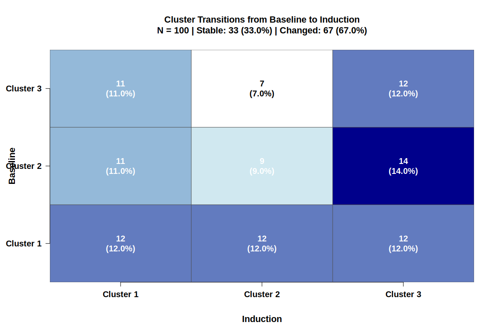

# Cluster Analysis with Pattern Visualization

[](https://www.r-project.org/)
[]()
[]()

**创建一个类似图片的通用的模式变化图，展示个体标签从base到induc变化的比例**

This repository contains R code for comprehensive clustering analysis with visualization of cluster label transitions from baseline to induction.



## 🎯 Quick Start

```r
# Install R packages (first time only)
install.packages(c("tidyverse", "ggplot2", "ggalluvial"))

# Create alluvial diagram
Rscript create_alluvial.R

# Run example analysis
Rscript example_usage.R

# Full analysis with all methods
Rscript Cluster.R
```

## 📊 Key Visualizations

The scripts create beautiful **alluvial diagrams** (桑基图/Sankey diagrams) that show:
- How individual patients move between clusters
- Transition patterns from baseline to induction
- Proportions visualized through flow width
- Color-coded by baseline cluster

**Alternative visualizations included:**
- Heatmaps of transition matrices
- Bar charts of pattern frequencies
- Scatter plots of clustering results

## Overview

The script performs clustering analysis using 5 common clustering methods:
1. **K-means** - with elbow method for optimal k selection
2. **Hierarchical Clustering** - with dendrogram and Ward's method
3. **Gaussian Mixture Model (GMM)** - with BIC for model selection
4. **DBSCAN** - with kNN distance plot for eps selection
5. **Affinity Propagation** - automatic cluster number determination

## Features

- **Data Preprocessing**: Log transformation and standardization of variables
- **Two Clustering Scenarios**:
  - Cluster 1: FC_base_log (standardized) + IBDQ_base (standardized)
  - Cluster 2: FC_induc_log (standardized) + IBDQ_induc (standardized)
- **Parameter Selection**: Each method uses appropriate criteria for optimal parameter selection
- **Visualization**:
  - Scatter plots for clustering results
  - **Alluvial diagrams** showing cluster transitions from baseline to induction
  - Pattern change visualization
- **Statistical Analysis**:
  - Baseline characteristics comparison tables
  - Logistic regression analysis by pattern groups

## Requirements

The script automatically installs required R packages:
- tidyverse
- cluster
- factoextra
- mclust
- dbscan
- apcluster
- ggalluvial
- gridExtra
- mice
- tableone

## Usage

### Basic Usage

```r
# Run the entire analysis
source("Cluster.R")
```

### Using Your Own Data

Replace the sample data generation section (lines 40-52) with your data loading code:

```r
# Example:
setwd("your/working/directory")
load("RCT3.RData")
data_test <- data_UNIFI

# Ensure your data has the following columns:
# - FC_base: Fecal calprotectin at baseline
# - FC_induc: Fecal calprotectin at induction
# - IBDQ_base: IBDQ score at baseline
# - IBDQ_induc: IBDQ score at induction
# - Response: Binary outcome (optional, for regression)
# - Other baseline characteristics (Age, Sex, etc.)
```

## Output

All results are saved to the `output/` directory:

### Clustering Evaluation Plots
- `kmeans_elbow_base.png` / `kmeans_elbow_induc.png` - Elbow method plots
- `hclust_dendrogram_base.png` / `hclust_dendrogram_induc.png` - Dendrograms
- `gmm_bic_base.png` / `gmm_bic_induc.png` - BIC plots
- `dbscan_knn_base.png` / `dbscan_knn_induc.png` - kNN distance plots

### Scatter Plots
- `[method]_scatter_base.png` - Clustering visualization at baseline
- `[method]_scatter_induc.png` - Clustering visualization at induction
  - Where [method] = kmeans, hclust, gmm, dbscan, ap

### Alluvial Diagrams
- `alluvial_kmeans.png` - K-means cluster transitions
- `alluvial_hclust.png` - Hierarchical clustering transitions
- `alluvial_gmm.png` - GMM transitions
- `alluvial_dbscan.png` - DBSCAN transitions
- `alluvial_ap.png` - Affinity Propagation transitions

**These diagrams show the flow of individual patients from baseline clusters to induction clusters, with width proportional to the number of patients in each transition.**

### Statistical Analysis
- `baseline_table_kmeans.txt` - Baseline characteristics by pattern
- `logistic_model1.txt` - Logistic regression (pattern only)
- `logistic_model2.txt` - Logistic regression (pattern + covariates)
- `odds_ratios_model1.csv` - Odds ratios from model 1
- `odds_ratios_model2.csv` - Odds ratios from model 2
- `data_with_clusters.csv` - Complete dataset with all cluster assignments

## Alluvial Diagram Interpretation

The alluvial diagrams visualize how individual cluster labels change from baseline to induction:

- **Left axis**: Cluster assignments at baseline
- **Right axis**: Cluster assignments at induction
- **Flow width**: Proportional to the number of patients in each transition
- **Colors**: Distinguished by baseline cluster

Common patterns:
- **Stable**: Same cluster at both timepoints (e.g., 1→1, 2→2)
- **Improved**: Moving from high-risk to low-risk cluster
- **Worsened**: Moving from low-risk to high-risk cluster

## Customization

### Adjust Number of Clusters

The default optimal k is set to 3. You can modify this in the script:

```r
optimal_k <- 3  # Change to your desired number
```

### Adjust DBSCAN Parameters

```r
dbscan_base <- dbscan(cluster_data_base, eps = 0.5, minPts = 5)
# Adjust eps and minPts based on your kNN distance plot
```

### Add More Variables to Baseline Table

```r
baseline_vars <- c("Age", "Sex", "FC_base", "IBDQ_base", "YourVariable")
```

## Citation

If you use this code, please cite appropriately and reference the clustering methods used:
- K-means: MacQueen (1967)
- Hierarchical: Ward (1963)
- GMM: Fraley & Raftery (2002) - mclust package
- DBSCAN: Ester et al. (1996)
- Affinity Propagation: Frey & Dueck (2007)
- Alluvial diagrams: Rosvall & Bergstrom (2010) - ggalluvial package

## License

This code is provided as-is for research and educational purposes.